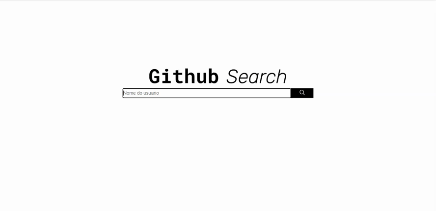

<h1 align="center">
<br>
  
<br>
<br>
Github Search
</h1>

<p align="center">Github Search é uma aplicação client-side, que consulta a API do GitHub e mostra os
repositórios de um determinado usuário.</p>

<p align="center">
  <a href="https://opensource.org/licenses/MIT">
    
  </a>
</p>

<div>
    <h1>Exemplo de Busca</h1>
    <p>Usuario encontrado:</p>
  
    <br>
    <br>
    <p>Usuario não encontrado:</p>
  
</div>

<hr />

## Features

- **Vue Js** — Um framework JavaScript de código-aberto, focado no desenvolvimento de interfaces de usuário e SPA.
- **Node Js** — Um framework da web para Node Js.
<br>
<br>
<hr />

## Getting started

### - Pré-requisitos

- Node.js
- Yarn ou NPM
<br>
<br>

### - Instalando Dependencias
No diretório web inserir o comando: <br>
para npm
``` bash
npm install
```
para yarn
``` bash
yarn
```
<br>

### - Rodando aplicação
No diretório web inserir o comando: <br>
para npm
``` bash
npm run dev
```
para yarn
``` bash
yarn dev
```

## License

This project is licensed under the MIT License - see the [LICENSE](https://opensource.org/licenses/MIT) page for details.